```{r, include = FALSE}
knitr::opts_chunk$set(
  collapse = TRUE,
  comment = "#>"
)
```
# Quick Start

- __Inputs:__ 
	- paired-end fastq files to a galaxy [@Afgan2016; @Jalili2020] history as `list of dataset pairs`
	- A suitable genome fasta file (*C. elegans*, ce11.fa.gz - Compatible with WBcel235.86 used by SnpEff)
- Run the Pipeline: https://usegalaxy.eu/u/richardjacton/w/c-elegans-ems-mutagenesis-mutation-caller
- __Outputs:__ 
	- [`MultiQC`](https://multiqc.info/) HTML report with QC info on the input fastqs, trimming, mapping, and deduplication steps.
	- `.vcf` file with variants from all samples (FreeBayes mutation caller)
	- `.vcf` file with variants from all samples (MiModD mutation caller)
	- `.gff` file with deletions from all samples (MiModD deletion calling tool)
- Perform Quality filtering and appropriate set subtractions with [`MutantSets`](https://github.com/RichardJActon/MutantSets) or alternatively the `MiModD VCF Filter` or `SnpSift Filter` tools to identify candidate variants.
- (optionally) `MiModD NacreousMap` for visualisation of mutation locations and `MiModD Report Variants` for HTML mutation list

NB samples are expected to be of the form 'A123_0001_S1_R1_L001.fq.gz', sample Identifiers are extracted from this with a regular expression: `\w+_(\d+)_S\d+_L\d+.*`. This would yield the sample identifier of: 0001. If your file does not conform to this pattern you may need to update this regex by editing the rules in the 'apply rule to collection' step of the workflow.

# Background

Doitsidou et al. reviewed Sequencing-Based Approaches for Mutation Mapping and Identification in *C. elegans* [@Doitsidou2016]. They describe three main approaches to mapping by sequencing:

1. Hawaiian variant mapping
2. EMS-density mapping
3. Variant discovery mapping

This pipeline is currently only compatible with 2 of them, EMS-density mapping & Variant discovery mapping (VDM).

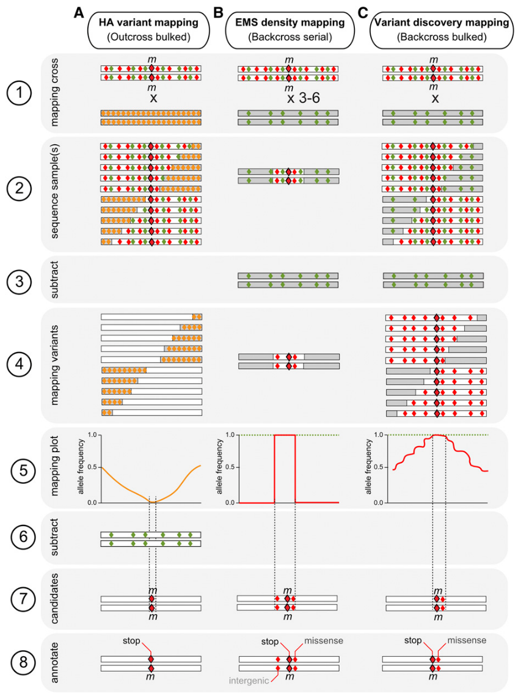

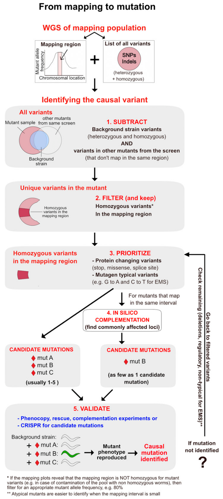

## Research Need

The Schumacher lab identified a need for an analysis pipeline to map and identify mutations in Ethyl methanesulfonate (EMS) mutagenesis forward genetic screens.

Previously a tool called `CloudMap` [@Minevich2012] had been used for this purpose on a Galaxy server.
`CloundMap` is no longer under active development and has been deprecated from [Galaxy Europe](https://usegalaxy.eu/) and replaced by `MiModD` [Docs](https://mimodd.readthedocs.io/en/doc0.1.8/index.html)

## Choice of Tools

In a comparison of *C. elegans* mutation calling pipelines Smith et al. [@Smith2017a] indicated that they had good results with the `FreeBayes` [@Garrison2012].
So I have initially included this tool here in addition to the`MiModD` mutation caller to evaluate their relative performance.
They also found the the `BBMap` aligner yielded better results however this is not available in Galaxy so I have opted for `Bowtie2` for expediency.

# Pipeline Summary

[Pipeline File (Local)](assets/Galaxy-Workflow-EMS_Mutagenesis_Backcross_Mutation_Caller.ga)

https://usegalaxy.eu/u/richardjacton/w/c-elegans-ems-mutagenesis-mutation-caller

- Adapter and Quality Trimming with [`fastp`](https://github.com/OpenGene/fastp) [@Chen2018]
- Alignment with [`bowtie2 --sensitive-local`](https://github.com/BenLangmead/bowtie2) [@Langmead2012]
- [`samtools view`](https://github.com/samtools/samtools) requiring that reads are mapped in a proper pair [@Li2009b]
- Removal of PCR duplicates with [`Picard MarkDuplicates`](https://broadinstitute.github.io/picard/command-line-overview.html#MarkDuplicates) [@BroadInstitute2019]
- Left alignment of indels in the BAM files using [`FreeBayes`](https://github.com/ekg/freebayes) [@Garrison2012]
- [`MultiQC`](https://github.com/ewels/MultiQC) aggregating quality metrics from trimming, deduplication and alignment [@Ewels2016]
- Variant calling with [`FreeBayes`](https://github.com/ekg/freebayes) [@Garrison2012], [`MiModD`](https://mimodd.readthedocs.io/) [@Baumeister2013] variant caller and deletion caller
- SNP effect annotation with [`SnfEff eff`](http://snpeff.sourceforge.net/SnpEff.html) [@Cingolani2012]
- SNP type annotation with [`SnpSift Variant Type`](http://snpeff.sourceforge.net/SnpSift.html) [@Cingolani2012]

# Instructions (Step-by-Step)

__1. Upload Data to galaxy__

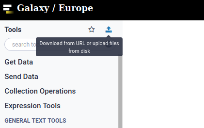

__2. Select all fastq files and create a paired list__

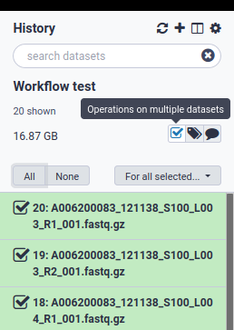

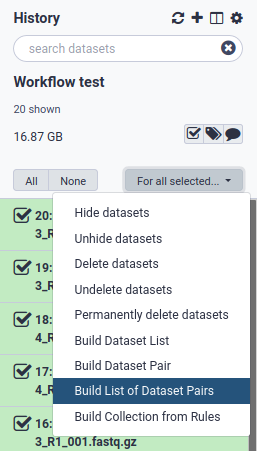

__3. Pair the fastq files__

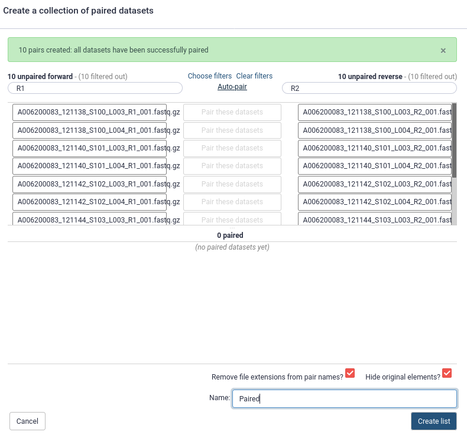

__4. Import the [workflow](https://usegalaxy.eu/u/richardjacton/w/c-elegans-ems-mutagenesis-mutation-caller)__

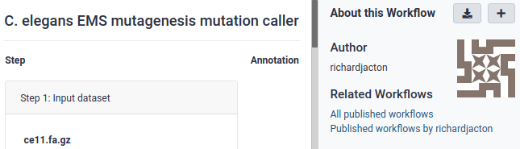

__5. Run the workflow__

Select the paired list object and a genome sequence file as inputs

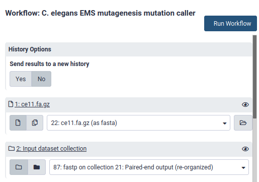

__6. Check Quality Control Information__

Inspect the `MultiQC` output for signs of technical problems with your data.
Consult with your friendly local bioinformatician if there are QC issues you can't diagnose.

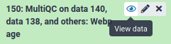

__7. Preliminary quality filtering `SnpSift filter`__

Locate the [`SnpSift filter`](https://pcingola.github.io/SnpEff/SnpSift.html#filter) tool in the galaxy tools panel and apply some initial quality filters, simply `( QUAL > 15)` or `20` is probably sufficient. 
Starting with a low stringency filter and applying more stringent criteria when inspecting your candidate mutations it is probably advisable to avoid throwing out possible mutations.
Some initial filtering is advisable as the full-sized VCF files may be too large to be easily read by the candidate mutant inspection tool in the next steps.
You can check how many lines are in your VCF files by selecting them in the Galaxy history.

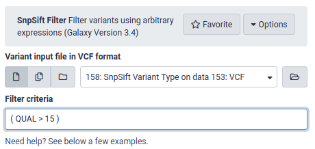

__8. Download Data__

The main `FreeBayes` VCF file:

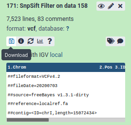

The `MiModD` deletion calls:

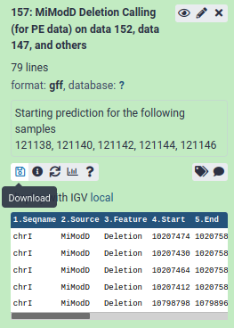

__9. Load the results in the `MutantSets` Shiny App to identify candidate mutations__

If running the App locally, install the [`R`](https://www.r-project.org/) package from: https://github.com/RichardJActon/MutantSets

R package installation and running the app locally:

```
# install.packages("remotes") # If you don't already have remotes/devtools
# remotes::install_github("knausb/vcfR") # If vcfR fails to install from CRAN
remotes::install_github("RichardJActon/MutantSets")
MutantSets::launchApp() # opens the app in a web browser
```

- Load the VCF and (optionally) the gff deletion mutant files into `MutantSets`
- (Optionally) Name your samples something easier to understand
- Use the genotype filters to subtract the appropriate sets
- Tweak quality and allele frequency thresholds to get a small set of high quality candidates
- Assess the candidate mutations by clicking on them and looking at their predicted effects and genomic locations
- Download your top results as a `.tsv` file (openable in excel)

__You should now have some candidate mutants to screen - Good Luck!__

# Feedback

Please direct bug reports, feature requests, and questions to the maintainer of the mutant sets package via [github issues](https://github.com/RichardJActon/MutantSets/issues. 

# References

```{r, echo=FALSE, include=FALSE, eval=FALSE}
getCitations::getCitations(
	normalizePath("C-elegans_Backcross_mutation_calling_Galaxy_Workflow.Rmd"),
	normalizePath("assets/bib.bib"),
	"~/Documents/bibtex/library.bib"
)
```

